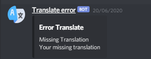

# node-I18n

Same module of [node-I18n](https://github.com/eslachance/node-i18n)

### Install

`npm i github:zechaos/node-i18n ` or `yarn add github:zechaos/node-i18n`

### To use
```
const node-I18n = require('node-I18n')
node-I18n.initWebhook(WebhookID,WebhookToken)
```
</img>
### Optional
```
const node-I18n = require('node-I18n')

node-I18n.initWebhook(WebhookID,WebhookToken,username,avatar)

//username: Your custom webhook username. default: Translate error
//avatar: Your custom webhook avatar. default: https://imgur.com/sK2kaum.png
```

